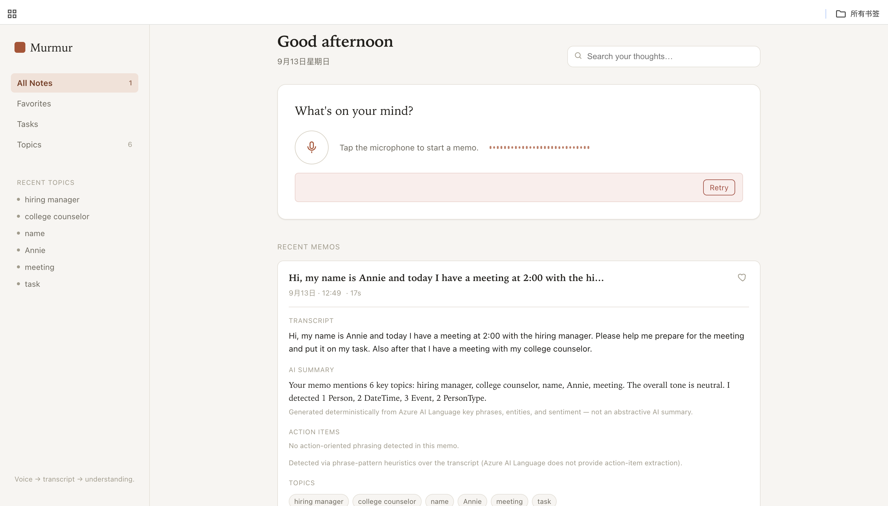
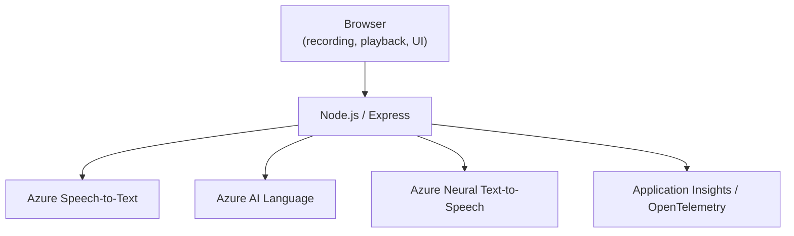

# Murmur — AI Voice Notes

**Turn your thoughts into structured, actionable notes.**

Voice → Transcript → Understanding → Tasks

### [**▶ Try Murmur Live**](https://csc391-speech-luozixiao.azurewebsites.net)

`https://csc391-speech-luozixiao.azurewebsites.net`

[](https://csc391-speech-luozixiao.azurewebsites.net)

---

## About Murmur

Murmur is a voice-first productivity app that turns spoken thoughts into searchable, structured notes. Record a memo in the browser and Murmur transcribes it, analyzes it with Azure's language services, and organizes the result into a transcript, summary, topics, and action items — all stored in a searchable history you can revisit, favorite, and act on.

## Features

- **In-browser voice recording** — no file upload, just record and go
- **Azure Speech-to-Text transcription**
- **Azure AI Language analysis** — key phrase extraction, named entity recognition, sentiment analysis
- **Structured summaries** composed from the extracted language data
- **Action-item detection** from the transcript
- **Task management** — track action items and manual to-dos in one place
- **Topics** — memos grouped by extracted key phrases
- **Favorites** for quick access to important memos
- **Instant search** across transcripts, summaries, topics, and action items
- **Azure Neural Text-to-Speech** — listen to any memo's summary read back to you
- **Memo history** — every recording saved locally and reloadable after a refresh

## Product Preview

The dashboard below shows a recorded memo expanded into its transcript, AI-derived summary, topics, and detected action items, alongside the sidebar navigation for Memos, Tasks, and Topics.


## Architecture



Memo history has no backend database — it's persisted client-side in the browser's `localStorage` by design, keeping the deployment simple and infrastructure-light.

## Tech Stack

**Frontend**
HTML, CSS, JavaScript (ES modules, no build step, no framework), Web Media APIs, `localStorage`

**Backend**
Node.js, Express

**Azure**
Azure Speech-to-Text · Azure AI Language · Azure Neural Text-to-Speech · Azure Application Insights · Azure App Service

**Observability**
OpenTelemetry (via `@azure/monitor-opentelemetry`)

## Voice Processing Pipeline

1. **Record** — the browser captures microphone audio and encodes it to WAV, with a live waveform driven by real mic amplitude.
2. **Transcribe** — the audio is sent to **Azure Speech-to-Text**, returning a transcript, detected language, and a confidence score.
3. **Analyze** — the transcript is sent to **Azure AI Language**, which returns key phrases, named entities, linked entities, and sentiment.
4. **Structure** — the app composes a summary and topic list from the Language output, and scans the transcript for action-item phrasing.
5. **Save** — the resulting memo (transcript, summary, topics, action items, sentiment) is saved to local history, searchable and ready to revisit.
6. **Listen** (optional) — the memo's summary can be sent to **Azure Neural TTS** and played back on demand.

## Task Management

Murmur's Tasks view brings together two sources of work:

- **Manually created tasks**, added directly from the Tasks view
- **Extracted tasks**, detected automatically from memo transcripts and linked back to their source memo

Each task supports:

- **Priority** — Low, Medium, or High
- **Due dates**, with tasks sorted by urgency
- **Completion state**, toggled with one click
- **Editing and deletion**
- A link back to the **source memo** for extracted tasks
- Filtering by **All / Today / Upcoming / Completed**

All task data — manual and extracted — is persisted in the browser's `localStorage`, alongside memo history.

## API

| Endpoint | Description |
|---|---|
| `POST /transcribe` | Audio in, transcript out (Azure Speech only) |
| `POST /analyze` | Text in, Azure AI Language analysis out (key phrases, entities, sentiment) |
| `POST /process` | Full pipeline: audio in → transcript + language analysis + summary + summary audio out |
| `POST /speak` | Text in, Azure Neural TTS audio out |
| `GET /telemetry-summary` | Aggregated latency, confidence, and sentiment stats from the current server process |

## Running Locally

**1. Clone and install**

```bash
git clone https://github.com/AnnieZX/murmur-ai-voice-notes.git
cd murmur-ai-voice-notes
npm install
```

**2. Configure environment variables**

```bash
cp .env.example .env
```

Fill in your own Azure resource values — never commit real keys:

```
AZURE_SPEECH_KEY=
AZURE_SPEECH_REGION=
AZURE_LANGUAGE_KEY=
AZURE_LANGUAGE_ENDPOINT=
APPLICATIONINSIGHTS_CONNECTION_STRING=
```

**3. Run**

```bash
node server.js          # local dev server (accepts WAV/MP3, converts via ffmpeg-static)
# or
node server_azure.js    # Azure deployment entrypoint (WAV only, full OpenTelemetry instrumentation)
```

Open `http://localhost:3000`.

## Technical Accuracy / Implementation Notes

In the interest of being precise about what's real AI output versus local logic:

- Speech transcription is performed by **Azure Speech-to-Text**.
- Key phrases, entities, and sentiment are produced by **Azure AI Language**.
- The `summary_text` returned by the pipeline is **deterministically composed** from Azure AI Language's key phrases, sentiment, and entity data — it is not generated by an LLM or an abstractive summarization model.
- Action-item detection uses **conservative phrase-pattern heuristics** over the transcript (e.g. "need to," "remember to," "follow up") rather than a dedicated AI extraction capability.

These features aren't marketed as LLM-generated because they aren't — see the [Roadmap](#roadmap) for where generative capabilities are planned.

## Deployment

The public demo is deployed on **Azure App Service**. It currently runs on the **Free tier**, so the app may experience a cold start (a delay of several seconds) after periods of inactivity.

## Roadmap

- Generative/semantic summarization using an LLM, replacing the current deterministic summary
- Richer, semantic action-item extraction beyond phrase-pattern matching
- Optional Gmail integration to draft emails from tasks, with the user reviewing and sending explicitly — no automated sending

---

### [**▶ Try Murmur Live**](https://csc391-speech-luozixiao.azurewebsites.net)
